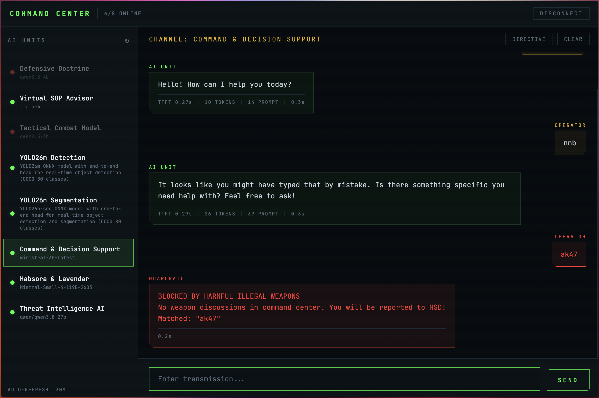

# snuc-openshift-ai

AI inference and tooling running on a three-node SNUC cluster under OpenShift AI.



This is an edge cluster of AMD Ryzen AI 9 HX370 PCs, and that shapes almost
everything in here. There are no discrete GPUs — just one Radeon 890M integrated GPU
per node, sharing system RAM. Which accelerator backend works, how much memory a pod
may request, and which models can be served at all are decided by that hardware, not
by preference. Those constraints are documented in [Hardware Notes](#hardware-notes);
read them before adding a workload.

## The Cluster

OpenShift 4.21 with OpenShift AI (Open Data Hub), three nodes, RHEL CoreOS 9.6.

| | snuc-01 | snuc-02 | snuc-03 |
|---|---|---|---|
| CPU | 24 vCPU (23.5 allocatable) | 24 vCPU | 24 vCPU |
| System RAM | 62 GB allocatable | 62 GB | 46 GB |
| GPU | Radeon 890M | Radeon 890M | Radeon 890M |
| Dedicated VRAM | 32 GB | 32 GB | 48 GB |

Every node is an AMD Ryzen AI 9 HX 370 with a Radeon 890M iGPU (gfx1150, 16 CU).
One GPU each, so **three GPUs total** — which is the binding constraint on how many
accelerated workloads can run at once.

## Components

| Component | Description |
|---|---|
| [llm/llamacpp](llm/llamacpp/) | [llama.cpp](https://github.com/ggml-org/llama.cpp) as an OpenAI-compatible KServe inference server, Vulkan GPU acceleration. |
| [llm/lemonade](llm/lemonade/) | [Lemonade](https://github.com/lemonade-sdk/lemonade) as an alternative GGUF backend, also Vulkan. |
| [litellm](litellm/) | [LiteLLM](https://github.com/BerriAI/litellm) proxy + Postgres, for routing to external model providers. |
| [command-center](command-center/) | Web UI for managing and chatting with multiple AI models from one interface. |
| [vision-ai](vision-ai/) | Real-time object detection and instance segmentation (YOLO26) with a streaming web app. |

Command Center (pictured above) is the front door to all of this: KServe
InferenceServices and external providers appear side by side in one model list, with
per-response latency stats (TTFT, token count, prompt tokens) and guardrail
enforcement on blocked content.

## Architecture

```
                        ┌──────────────────────────────────────────┐
                        │            command-center                │
                        │     FastAPI + static UI, model proxy     │
                        └───────┬─────────────────────┬────────────┘
                                │                     │
                     KServe ISVc│                     │OpenAI-compatible
                      discovery │                     │  (external models)
                                ▼                     ▼
        ┌───────────────────────────────────┐   ┌──────────────┐
        │        KServe InferenceServices   │   │   litellm    │
        │                                   │   │    proxy     │
        │  llamacpp  │ lemonade │  YOLO26   │   └──────────────┘
        │   (GGUF)   │  (GGUF)  │  (ONNX)   │
        └───────────────────────────────────┘
                                 ▲
                           gRPC  │ :8001
                                 │
   ┌──────────────┐      ┌───────┴────────┐
   │ RTSP camera  │─────▶│  vision-ai app │─────▶ annotated MJPEG stream,
   │ / video file │      │ OpenCV+FastAPI │       snapshots, JSON API
   └──────────────┘      └────────────────┘
```

Each component owns its own `k8s/` manifests, `pipelines/`, and README. The component
README is authoritative for build and deployment steps.

## Serving Stack

### LLM serving (GGUF)

Two interchangeable backends serve GGUF models through KServe with an OpenAI-compatible
API on port 8080. Both auto-discover a `.gguf` file from the KServe model mount path.

| | llamacpp | lemonade |
|---|---|---|
| Server | `llama-server` | `lemond` |
| Acceleration | Vulkan | Vulkan |
| Model alias | filename | registered under the InferenceService name |

Tunables (`CONTEXT_LENGTH`, `N_GPU_LAYERS`, `REASONING_BUDGET`, `FLASH_ATTENTION`,
`EXTRA_ARGS`) are set as ServingRuntime defaults and overridable per-model on the
InferenceService. See [llm/llamacpp](llm/llamacpp/#configuration).

### Vision serving (ONNX)

YOLO26 models served via KServe, consumed over gRPC by the vision-ai app.

| Model | Purpose | Runtime |
|---|---|---|
| YOLO26m | Object detection (COCO 80 classes) | `onnxruntime-cpu` |
| YOLO26n-seg | Detection + instance segmentation | `onnxruntime-cpu` |

An `onnxruntime-migraphx` ServingRuntime also exists for GPU inference, but is not
currently in use — see the hardware note below.

## Hardware Notes

### VRAM is taken from system RAM

The 890M has no memory of its own. Dedicated VRAM is carved out of system RAM in
BIOS, so raising it directly reduces what pods can request on that node. snuc-03's
48 GB carve-out costs it 16 GB of schedulable RAM (46 GB vs 62 GB elsewhere) — enough
that a 4 GiB pod request no longer fits there.

Current GTT is 30.9 GB on snuc-01/02 and 23.0 GB on snuc-03. Read these per node with:

```bash
cat /sys/class/drm/card0/device/mem_info_vram_total   # dedicated VRAM
cat /sys/class/drm/card0/device/mem_info_gtt_total    # GTT (shared)
```

Since ROCm does not work here anyway (below), a larger VRAM reservation currently
buys nothing and only costs schedulable RAM.

### ROCm does not work on these iGPUs

ONNX Runtime with `ROCMExecutionProvider` fails at startup with
`Hip error: 'out of memory'` in hipblaslt init. **This is not a VRAM sizing problem.**
It was tested directly on both a 32 GB node and the 48 GB node, at container memory
limits from 8 GiB to 12 GiB, and fails identically every time. The AMD GPU is
successfully allocated to the pod — the failure is inside hipblaslt on gfx1150.

Consequences:

- GGUF backends (llamacpp, lemonade) use **Vulkan**, which addresses shared system
  memory and works fine.
- ONNX vision models run on `onnxruntime-cpu`. The `onnxruntime-migraphx`
  ServingRuntime exists but is unused; note its image ships `ROCMExecutionProvider`
  and `CPUExecutionProvider` but **no** MIGraphX provider, so naming MIGraphX in
  `--providers` silently falls through to CPU while still holding a GPU.
- Pair CPU-runtime models with the `cpu-only` hardware profile so they do not reserve
  a GPU they cannot use. That profile is defined in
  [vision-ai/hardware-profiles/](vision-ai/hardware-profiles/), not shipped by
  OpenShift AI.

## Repository Layout

```
llm/
  llamacpp/        # llama.cpp serving runtime + KServe manifests
  lemonade/        # Lemonade serving runtime + KServe manifests
litellm/           # LiteLLM proxy manifests
command-center/    # Web UI (app, k8s/, pipelines/)
vision-ai/         # Vision inference (app/, k8s/, pipelines/, argocd/, hardware-profiles/)
audio-samples/     # Shared test fixtures
video-samples/
```

## CI/CD

Tekton pipelines build each component and restart its deployment; ArgoCD syncs the
`k8s/` manifests. A shared `github-listener` EventListener in the `visionai` namespace
routes pushes to the right pipeline by branch.

## Setting Up From Scratch

### What you need first

- OpenShift with OpenShift AI 3.5 installed
- OpenShift GitOps (ArgoCD) and OpenShift Pipelines (Tekton) operators
- S3-compatible object storage (e.g., OpenShift Data Foundation) for model artifacts
- A container registry you can push to (this repo assumes an in-cluster Quay)
- An accelerator, if you want one that works. On **discrete** AMD or NVIDIA GPUs the
  ROCm limitation above does not apply, and the `onnxruntime-migraphx` runtime and
  `amd-gpu-vision` hardware profile become usable as written.

### Before you start: things that are hardcoded

These are baked into the manifests and will not match your cluster. Grep and replace
before applying anything:

| What | Current value |
|---|---|
| Workload namespace | `john` |
| Pipeline namespace | `visionai` |
| Registry host | `registry-quay-app.quay.svc.cluster.local` (in-cluster) and `quay.apps.snuc.kubernetes.day` (route) |
| Cluster domain | `apps.snuc.kubernetes.day` |
| Git remote | `github.com/explicitworkload/snuc-openshift-ai` |

> **Credentials are committed in plaintext** in `litellm/litellm-deployment.yaml`
> (`LITELLM_MASTER_KEY`, the Postgres DSN) and `command-center/k8s/deployment.yaml`
> (`COMMAND_PASSWORD`). These are demo values. Replace them — ideally move them to
> Secrets — before exposing anything.

### 1. Namespaces

```bash
oc new-project john      # workloads: models, apps
oc new-project visionai  # Tekton pipelines and triggers
```

### 2. Model storage

Create an OpenShift AI data connection in `john` pointing at your S3 bucket. It must
produce a secret named `models-odf-s3`. Then create the service account the
InferenceServices use to pull weights:

```bash
oc create sa models-odf-s3-sa -n john
```

Upload the ONNX models to the bucket:

```
/models/yolo26m.onnx        # detection
/models/yolo26n-seg.onnx    # segmentation
```

GGUF models for the LLM runtimes go in the same bucket; see
[llm/llamacpp](llm/llamacpp/) for the paths its InferenceService expects.

### 3. Secrets

```bash
# Registry push credentials for Tekton
oc create secret docker-registry quay-push-secret \
  --docker-server=<your-registry> \
  --docker-username=<user> --docker-password=<pass> -n visionai
oc annotate secret quay-push-secret -n visionai \
  tekton.dev/docker-0=https://<your-registry>

# GitHub webhook shared secret (only if you want push-triggered builds)
oc create secret generic github-webhook-secret \
  --from-literal=secret=<random-string> -n visionai

# RTSP camera credentials (only if vision-ai reads a live camera)
oc create secret generic rtsp-credentials \
  --from-literal=RTSP_URL='rtsp://<user>:<pass>@<camera-ip>/stream1' -n john
```

### 4. Build the images

The ServingRuntimes reference images that must exist before the models will start.
Build the vision serving images from `vision-ai/` (build context is `./vision-ai`):

```bash
podman build -f vision-ai/Dockerfile.rocm-base -t <registry>/visionai:rocm-base vision-ai/
podman build -f vision-ai/Dockerfile          -t <registry>/visionai:latest     vision-ai/
podman build -f vision-ai/Dockerfile.cpu      -t <registry>/visionai:cpu        vision-ai/
podman build -f vision-ai/app/Dockerfile      -t <registry>/visionai-app:yolox  vision-ai/
podman push <registry>/visionai:rocm-base && podman push <registry>/visionai:latest
podman push <registry>/visionai:cpu && podman push <registry>/visionai-app:yolox
```

`Dockerfile` builds `FROM` the `rocm-base` tag, so push that one first. The LLM and
command-center images build the same way from their own component directories.

### 5. Hardware profiles

Models on a CPU runtime should not reserve a GPU. OpenShift AI's `default-profile`
declares `amd.com/gpu` with `minCount: 1`, so anything referencing it takes a GPU
whether or not it can use one. `default-profile` is the **only** profile OpenShift AI
ships, so both profiles below have to be created — the InferenceServices reference
`cpu-only` by name and will not start without it:

```bash
oc apply -f vision-ai/hardware-profiles/cpu-only.yaml        # required
oc apply -f vision-ai/hardware-profiles/amd-gpu-vision.yaml  # only if you have a usable GPU
```

> If a GPU request was already injected into a stored InferenceService, changing the
> profile will **not** remove it — `oc apply` merges maps and leaves the key in place.
> Strip it explicitly:
> ```bash
> oc patch inferenceservice <name> -n john --type=json -p \
>   '[{"op":"remove","path":"/spec/predictor/model/resources/requests/amd.com~1gpu"},
>     {"op":"remove","path":"/spec/predictor/model/resources/limits/amd.com~1gpu"}]'
> ```

### 6. Deploy the workloads

ArgoCD owns the vision stack. Point it at your fork first, then apply:

```bash
oc apply -f vision-ai/argocd/application.yaml
```

The rest apply directly:

```bash
oc apply -f litellm/                   # LiteLLM proxy + Postgres
oc apply -f command-center/k8s/        # Web UI (RBAC, Deployment, Service, Route)
oc apply -f llm/llamacpp/servingruntime.yaml -f llm/llamacpp/inferenceservice.yaml
```

### 7. CI/CD (optional)

```bash
oc apply -f vision-ai/pipelines/workspace-pvc.yaml
oc apply -f vision-ai/pipelines/pipeline.yaml
oc apply -f command-center/pipelines/pipeline.yaml
oc apply -f vision-ai/pipelines/triggers.yaml   # EventListener + webhook Route
```

Then add the `github-webhook` route URL as a push webhook in your GitHub repo, using
the shared secret from step 3.

> `vision-ai/pipelines/triggers.yaml` declares **both** triggers on a shared
> EventListener. Removing either one from that file deletes it from the cluster on the
> next apply.

### 8. Verify

```bash
oc get inferenceservice -n john          # all should reach READY=True
oc get pods -n john
oc get route command-center -n john      # open the UI
```

If an InferenceService stays `Progressing`, check whether its pod is unschedulable —
on this cluster that is usually GPU or memory requests, not a model problem.
